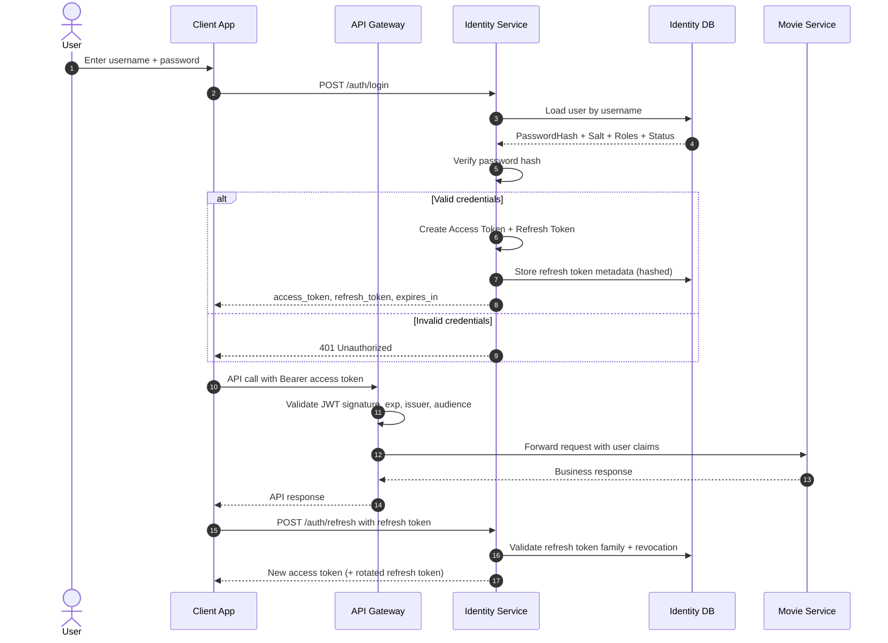
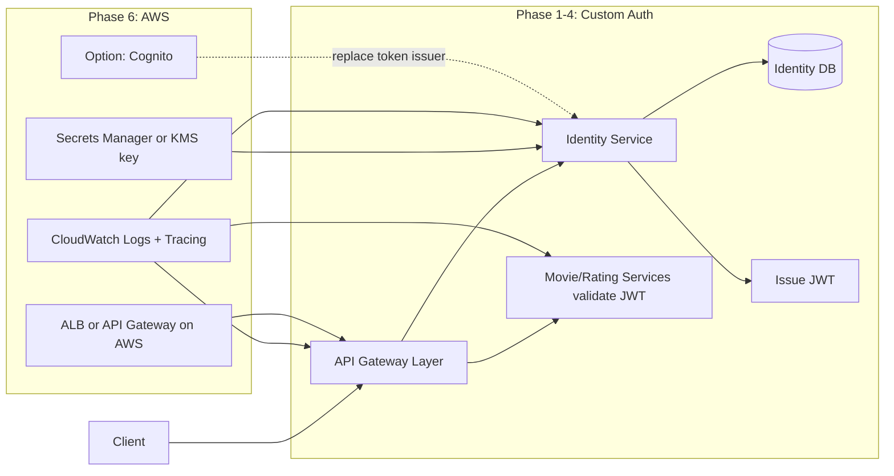

# Auth Flow (Interview Prep)

## 1) Core Decisions

- **User credentials storage:** Store users in the **Identity DB**.
- **Password handling:** Do **not** encrypt passwords. Store a **salted one-way hash** (e.g., Argon2/bcrypt).
- **JWT in login request:** No JWT is sent during login; login uses `username/password` only.
- **JWT usage:** JWT is returned after successful login and then sent in API calls as `Bearer <token>`.
- **Token model:** Use short-lived **access token** + longer-lived **refresh token**.

## 2) End-to-End Login + API Call Flow

## 3) Custom JWT Design (Now)

At successful login, Identity Service:
1. Validates password hash from DB.
2. Builds claims (minimal): `sub` (userId), `roles`, `iss`, `aud`, `iat`, `exp`, `jti`.
3. Signs JWT with configured signing key.
4. Returns access token + refresh token.

## 4) AWS Integration Path (Later)

## 5) Security Baseline

- Access token expiry: ~10–15 minutes.
- Refresh token expiry: days/weeks with rotation + revocation support.
- Store refresh tokens hashed (or strong token fingerprint metadata), not plaintext.
- Validate `iss`, `aud`, signature, expiry on every protected request.
- Keep claims small and stable to reduce coupling.

## 6) Interview-Friendly Summary (2 minutes)

“We keep auth in a dedicated Identity Service. User credentials are stored in Identity DB with salted one-way password hashes. Login accepts username/password only; on success, Identity issues a short-lived JWT access token and a longer-lived refresh token. The client sends the access token in Bearer headers for API calls. Gateway/services validate signature and claims (`iss`, `aud`, `exp`, roles). Refresh tokens are rotated and revocable for logout/session control. Later on AWS, we externalize secrets using Secrets Manager/KMS, add tracing/logging, and can optionally migrate token issuance to Cognito without changing downstream service contracts.”
