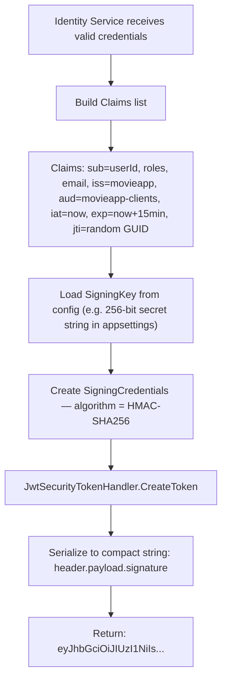
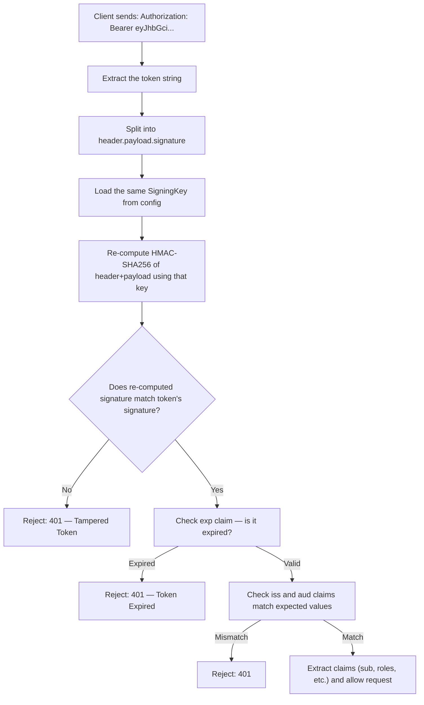
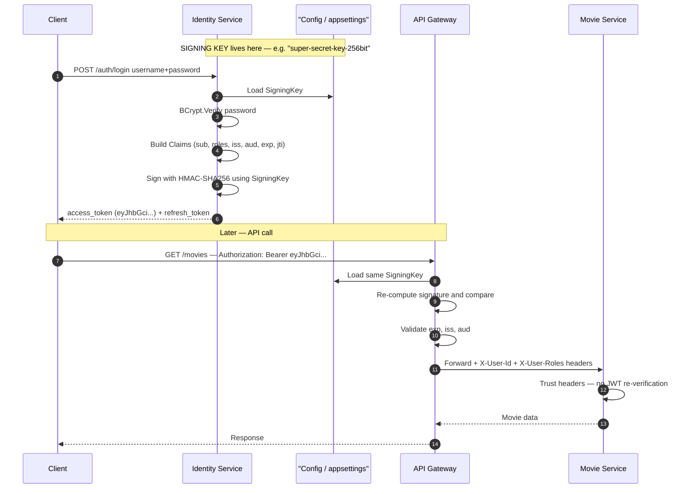

# Auth Deep Dive — Questions & Answers

## Q1 — What is hash + salt + roles + status?

These are columns stored in your `Users` table inside Identity DB.

| Column | What it is |
|---|---|
| `PasswordHash` | Result of running the password through a one-way hash function (BCrypt) |
| `Salt` | A random string generated per user, mixed into the password before hashing so two users with the same password get different hashes. BCrypt embeds salt inside the hash string automatically |
| `Roles` | e.g., `["user", "admin"]` — used as claims inside the JWT |
| `Status` | `Active / Suspended / Deleted` — lets you block login without deleting the user |

---

## Q2 — How do we hash the password?

**At registration:**
```
BCrypt.HashPassword("mypassword123")  →  store result in DB
```

**At login:**
```
BCrypt.Verify("mypassword123", storedHash)  →  returns true / false
```

- Never store the raw password.
- Never "decrypt" it — hashing is one-way.
- BCrypt handles the salt internally; you do not manage salt separately.

---

## Q3 — How does Identity Service create an access token without AWS/ADFS?

Using .NET's `System.IdentityModel.Tokens.Jwt` library. No external system needed.

**Generation flow:**



The JWT is just a **signed string**. No database call. No external service.  
The secret key is what makes it trusted.

---

## Q4 — Should the DB store access tokens?

**Access tokens: NO.**  
They are stateless — verification happens by checking the signature and expiry, not a DB lookup.

**Refresh tokens: YES (stored hashed).**  
Because you need to support:
- Rotation (detect reuse of already-used refresh tokens)
- Logout / revocation
- Per-device session tracking

| Token | Stored in DB? | Reason |
|---|---|---|
| Access Token | ❌ No | Stateless; signature + expiry is sufficient |
| Refresh Token | ✅ Yes (hashed) | Needs revocation, rotation, session management |

> **Fix from earlier flow diagram:** Step 8 should say "DB stores refresh token", not access token.

---

## Q5 — How is the JWT verified? Based on what?



**No DB call during verification.**  
The secret key IS the trust. Anyone who holds the same key can verify the token independently.

---

## Q6 — Gateway verifies JWT — does Identity or Movie Service also verify?

Two valid patterns:

| Pattern | Who Verifies | When to Use |
|---|---|---|
| **Gateway-only** ✅ (recommended for this project) | API Gateway only; services trust forwarded claims | Simpler, single enforcement point |
| **Defense-in-depth** | Gateway + each service independently | High security, services exposed outside gateway |

**Decision for movieApp:**  
Gateway verifies the JWT, then strips it and forwards trusted headers to downstream services:
- `X-User-Id: <userId>`
- `X-User-Roles: user,admin`

Movie Service and Rating Service trust those headers. They do **not** re-verify the JWT.

---

## Q7 — Complete Picture: Generation → Verification



**The key insight:**  
Identity Service and API Gateway share the **same secret key**.  
Identity uses it to **sign**. Gateway uses it to **verify**.  
No external auth server needed. That one shared secret is the entire trust mechanism.

---

## Summary Table

| Concern | Decision |
|---|---|
| Password storage | BCrypt hash in Identity DB |
| Access token storage | Not stored — stateless, verified by signature |
| Refresh token storage | Stored hashed in DB with revocation support |
| JWT generation | Custom — `System.IdentityModel.Tokens.Jwt` with a symmetric key |
| JWT verification | Shared symmetric key — re-compute and compare signature |
| Where JWT is verified | API Gateway only |
| Downstream services | Trust `X-User-Id` + `X-User-Roles` headers forwarded by gateway |


1. Call API → gets 401 Unauthorized (token expired)
2. Client checks: do I have a valid refresh token?
3. If yes → silently call POST /auth/refresh
4. Receive new access_token + new refresh_token
5. Retry the original failed API call with new access_token
6. If refresh also fails (401) → redirect user to login screen