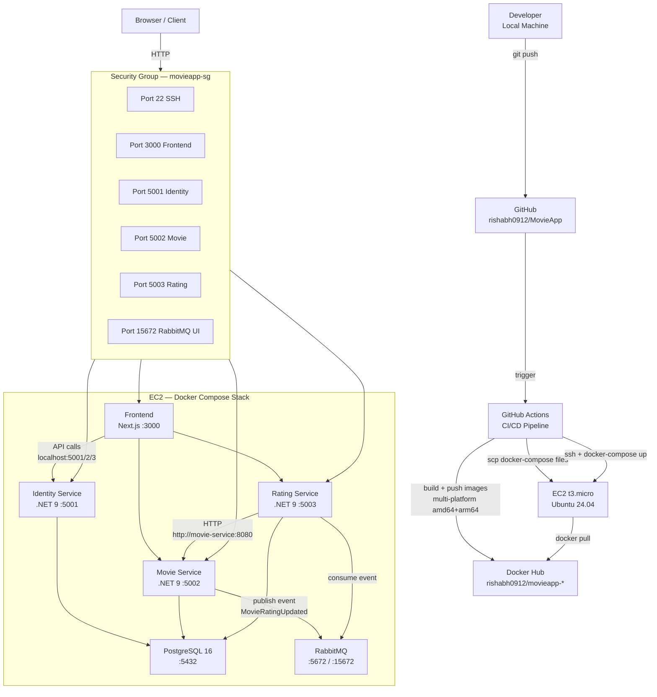
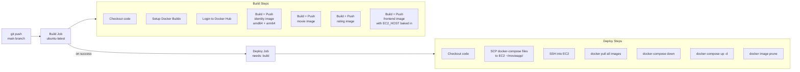
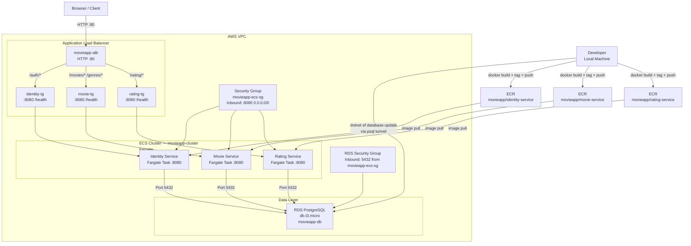
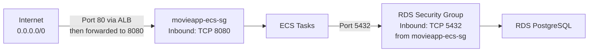
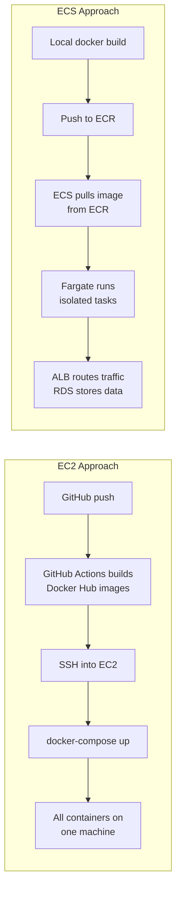
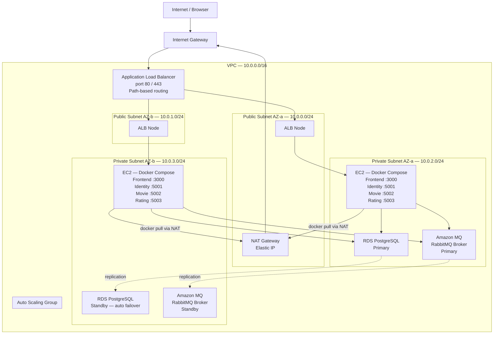

# AWS Deployment Guide — MovieApp

This document covers two deployment strategies used for MovieApp on AWS.

---

## Overview

| | EC2 Deployment | ECS Deployment |
|---|---|---|
| **Container Registry** | Docker Hub | Amazon ECR |
| **Compute** | EC2 t3.micro (Docker + Compose) | ECS Fargate (serverless containers) |
| **Database** | PostgreSQL container on EC2 | Amazon RDS PostgreSQL |
| **Networking** | Security Group + public ports | ALB + Target Groups + Security Groups |
| **CI/CD** | GitHub Actions → SSH deploy | Manual build + push to ECR |
| **Migrations** | Auto-migrate on startup (`db.Database.Migrate()`) | Manual (`dotnet ef database update`) |
| **Scaling** | Manual (resize instance) | Automatic (Fargate task count) |
| **Cost** | ~$0 (Free Tier t3.micro) | RDS + Fargate + ALB (~$30-50/month) |

---

## Deployment 1 — EC2 with Docker Compose

### Architecture Diagram



### Infrastructure Components

| Component | Details |
|---|---|
| **EC2 Instance** | t3.micro, Ubuntu 24.04 LTS, 20GB EBS |
| **Security Group** | movieapp-sg — ports 22, 3000, 5001, 5002, 5003, 15672 |
| **Docker Compose** | `docker-compose.yml` (postgres, rabbitmq) + `docker-compose.services.yml` (all services) |
| **Network** | `movieapp-network` bridge network — all containers communicate by container name |
| **Volumes** | `postgres_data` named volume — data persists across restarts |

### CI/CD Flow (GitHub Actions)



### GitHub Secrets Required

| Secret | Value |
|---|---|
| `DOCKER_USERNAME` | Docker Hub username |
| `DOCKER_PASSWORD` | Docker Hub access token |
| `EC2_HOST` | EC2 public IP (update after stop/start) |
| `EC2_USERNAME` | `ubuntu` |
| `EC2_SSH_KEY` | Full contents of `.pem` key file |

### Key Configuration Notes

- **CORS**: Services read `Cors__AllowedOrigins` env var → `http://${EC2_HOST:-localhost}:3000`
- **Frontend API URLs**: `NEXT_PUBLIC_*` vars baked into the Next.js bundle at build time via Docker `ARG`
- **Inter-service communication**: Rating Service calls Movie Service at `http://movie-service:8080` (container name, not localhost)
- **Migrations**: Each service runs `db.Database.Migrate()` on startup — creates DB + applies schema automatically
- **Startup order**: Services `depends_on` postgres with `condition: service_healthy` to avoid migration failures

### Operational Notes

- **Stop instance when not in use** to avoid OOM crashes on t3.micro (1GB RAM)
- **Allocate Elastic IP** to keep the same IP across stop/start cycles
- **Add swap** to avoid OOM kills: `sudo fallocate -l 1G /swapfile && sudo mkswap /swapfile && sudo swapon /swapfile`
- **Data migration from local**: `docker exec my_postgres pg_dump --data-only -U postgres <DbName> > dump.sql` then SCP to EC2 and restore

---

## Deployment 2 — ECS Fargate with RDS

### Architecture Diagram



### Infrastructure Components

| Component | Details |
|---|---|
| **ECR** | 3 private repos: `movieapp/identity-service`, `movieapp/movie-service`, `movieapp/rating-service` |
| **ECS Cluster** | `movieapp-cluster`, Fargate launch type |
| **Task Definitions** | One per service — Fargate, image from ECR, health check on `/health` |
| **ECS Services** | One per task definition, attached to `movieapp-ecs-sg`, public IP assigned |
| **RDS** | PostgreSQL `db.t3.micro`, identifier `movieapp-db`, 3 databases: IdentityDb, MovieDb, RatingDb |
| **ALB** | `movieapp-alb`, internet-facing, HTTP :80, 3 target groups with path-based routing |
| **IAM Role** | `AWSServiceRoleForECS` — allows ECS to manage ENIs, pull images, attach load balancer |

### Security Group Configuration



### ALB Routing Rules

| Path Pattern | Target Group | Service |
|---|---|---|
| `/auth/*` | identity-tg | Identity Service |
| `/movies/*` | movie-tg | Movie Service |
| `/genres/*` | movie-tg | Movie Service |
| `/rating/*` | rating-tg | Rating Service |

### Build & Push Commands (Manual)

```bash
# 1. Authenticate with ECR (token expires every 12h)
aws ecr get-login-password --region ap-south-1 | \
  docker login --username AWS --password-stdin 203193248552.dkr.ecr.ap-south-1.amazonaws.com

# 2. Build images
docker build -t movieapp/identity-service ./src/IdentityService
docker build -t movieapp/movie-service     ./src/MovieService
docker build -t movieapp/rating-service    ./src/RatingService

# 3. Tag with ECR URIs
docker tag movieapp/identity-service:latest 203193248552.dkr.ecr.ap-south-1.amazonaws.com/movieapp/identity-service:latest
docker tag movieapp/movie-service:latest    203193248552.dkr.ecr.ap-south-1.amazonaws.com/movieapp/movie-service:latest
docker tag movieapp/rating-service:latest   203193248552.dkr.ecr.ap-south-1.amazonaws.com/movieapp/rating-service:latest

# 4. Push to ECR
docker push 203193248552.dkr.ecr.ap-south-1.amazonaws.com/movieapp/identity-service:latest
docker push 203193248552.dkr.ecr.ap-south-1.amazonaws.com/movieapp/movie-service:latest
docker push 203193248552.dkr.ecr.ap-south-1.amazonaws.com/movieapp/rating-service:latest
```

### Database Migration (Manual via RDS)

```bash
# Connect to RDS from local machine (requires RDS inbound rule: port 5432, My IP)
psql -h movieapp-db.cnfwzivjzbee.ap-south-1.rds.amazonaws.com -U postgres -p 5432

# Create databases
CREATE DATABASE "IdentityDb";
CREATE DATABASE "MovieDb";
CREATE DATABASE "RatingsDb";

# Run EF migrations per service
ConnectionStrings__DefaultConnection="Host=<rds-endpoint>;Port=5432;Database=MovieDb;Username=postgres;Password=postgres" \
dotnet ef database update \
    --project ./src/MovieService/MovieService.Infrastructure \
    --startup-project ./src/MovieService/MovieService.Api
```

---

## Comparison Summary



| | EC2 | ECS |
|---|---|---|
| **Complexity** | Low | High |
| **Cost** | ~$0 (free tier) | ~$30-50/month |
| **Scaling** | Manual | Automatic |
| **Managed DB** | No (container) | Yes (RDS) |
| **CI/CD** | Automated (GitHub Actions) | Manual |
| **Best for** | Dev/demo/portfolio | Production |

---

## Deployment 3 — Ideal Production Architecture (EC2 + ALB + ASG + Private Subnets)

This section describes the **ideal way** to run the current Docker/Docker Compose setup on EC2 in a production-grade AWS environment. No ECS or Fargate required — just better networking and managed backing services.

---

### What's Wrong With the Current EC2 Setup

The current EC2 instance sits directly in a **public subnet** with a public IP. The security group opens service ports directly to `0.0.0.0/0`.

| Issue | Risk |
|---|---|
| Services directly internet-reachable | Any vulnerability in a service is exposed globally |
| No load balancer | EC2 goes down → full outage |
| No auto-scaling | Traffic spike or OOM crash → no recovery |
| EC2 restart changes public IP | Must update GitHub secrets manually each time |
| RabbitMQ UI (port 15672) exposed | Admin panel accessible from the internet |
| Single AZ | AWS AZ outage = full downtime |

---

### Ideal Architecture

**Core principle: only the ALB lives in the public subnet. EC2 instances, the database, and the message broker all live in private subnets.**

```
Internet
    │
    ▼
[Internet Gateway]        ← single entry point into the VPC
    │
  Public Subnets (AZ-a, AZ-b)
    ├── ALB               ← only public-facing component (port 80/443)
    └── NAT Gateway       ← allows private resources to make outbound calls

  Private Subnets (AZ-a, AZ-b)
    ├── ASG → EC2 instances (Docker Compose running your containers)
    ├── RDS PostgreSQL Multi-AZ  (optional — or keep Postgres in Docker)
    └── Amazon MQ (RabbitMQ)     (optional — or keep RabbitMQ in Docker)
```

#### Traffic Flow

```
Browser → Internet Gateway → ALB (public subnet)
        → ALB routes to EC2 in ASG (private subnet)
        → EC2 containers → RDS / Amazon MQ (private subnet)

EC2 (private) → NAT Gateway (public subnet) → Internet
  used for: docker pull, apt-get, outbound API calls
```

---

### Full Architecture Diagram



---

### Component Responsibilities

#### Internet Gateway (IGW)
- Attached to the VPC — enables public subnets to reach the internet
- ALB's public IP is routable because of the IGW
- **Private subnets have no route to the IGW** — that's the isolation guarantee

#### ALB (Application Load Balancer)
- Lives in **both public subnets** (cross-AZ for HA)
- Single DNS name — no IP changes ever
- Path-based routing (same rules as ECS deployment):

| Path Pattern | Target Group | Service |
|---|---|---|
| `/auth/*` | identity-tg | Identity Service :5001 |
| `/movies/*`, `/genres/*` | movie-tg | Movie Service :5002 |
| `/rating/*` | rating-tg | Rating Service :5003 |
| `/` | frontend-tg | Frontend :3000 |

- Security Group: inbound **80/443 from `0.0.0.0/0` only**
- EC2 instances are **not accessible from the internet** — only via ALB

#### ASG (Auto Scaling Group)
- Manages EC2 instances across **private subnets in both AZs**
- Replaces unhealthy instances automatically
- Scales out on CPU/memory threshold
- New instances auto-register with the ALB target group
- EC2s still run **Docker Compose** — no change to the app itself

#### NAT Gateway
- Lives in a **public subnet** with an Elastic IP
- Private subnet route table: `0.0.0.0/0 → NAT Gateway`
- Allows EC2s in private subnets to make outbound calls (docker pull, package installs, external APIs)
- **Inbound connections are blocked** — NAT is one-way (outbound only)
- One NAT per AZ for full HA; share one to reduce cost in dev

#### Route Tables

| Subnet Type | Destination | Target |
|---|---|---|
| Public | `0.0.0.0/0` | Internet Gateway |
| Private | `0.0.0.0/0` | NAT Gateway |
| Both | `10.0.0.0/16` | local (automatic) |

#### Security Groups (Revised)

| Security Group | Inbound Port | Source |
|---|---|---|
| `alb-sg` | 80, 443 | `0.0.0.0/0` |
| `ec2-sg` | 3000, 5001, 5002, 5003 | `alb-sg` only |
| `ec2-sg` | 22 (SSH) | Bastion SG or VPN CIDR only |
| `db-sg` | 5432 | `ec2-sg` only |
| `mq-sg` | 5671, 5672, 15671 | `ec2-sg` only |

No service port is open to `0.0.0.0/0` except the ALB.

---

### SSH Access (EC2 Has No Public IP)

Since EC2 is in a private subnet, direct SSH is not possible. Two options:

**Option A — Bastion Host**
- Small EC2 (`t3.nano`) in the public subnet, port 22 open to your IP only
- `ssh -J ec2-user@<bastion-ip> ubuntu@<private-ec2-ip>`

**Option B — AWS Systems Manager Session Manager** (recommended)
- No open port 22 anywhere
- `aws ssm start-session --target <instance-id>` from your terminal
- Requires `AmazonSSMManagedInstanceCore` IAM role attached to the EC2

---

### PostgreSQL — Docker vs RDS

PostgreSQL currently runs as a Docker container on the EC2 instance. This is fine for dev. For production, RDS Multi-AZ is the better choice.

| | PostgreSQL in Docker | RDS Multi-AZ |
|---|---|---|
| **Cost** | Free (uses EC2 EBS disk) | ~$25–50/month (db.t3.micro) |
| **High Availability** | No failover — container goes down, DB is gone | Automatic standby + failover (~60s) |
| **Backups** | Manual (`pg_dump`) | Automated daily snapshots + Point-in-Time Recovery |
| **Maintenance** | You manage Postgres version and patches | AWS manages it |
| **Data risk** | EBS volume — corruption or EC2 loss = data loss | Multi-AZ replication on separate storage |
| **Scaling** | Must resize the EC2 | Resize RDS independently without touching EC2 |
| **Best for** | Dev / learning / portfolio | Production with real users |

**Recommendation**: Keep Postgres in Docker for dev. Move to RDS Multi-AZ when data loss becomes unacceptable.

---

### RabbitMQ — Docker vs Amazon MQ vs SQS

RabbitMQ running in Docker on the same EC2 is the riskiest component. If the EC2 restarts, **in-flight messages can be lost** unless durable queues and persistent volumes are carefully configured.

#### Option 1: Amazon MQ (Managed RabbitMQ) — Recommended

AWS runs RabbitMQ for you. **Zero code changes** — it's the same AMQP protocol.

```
EC2 containers → AMQP port 5671 (TLS) → Amazon MQ broker (private subnet)
```

- Active/standby brokers across two AZs
- Messages persisted to EBS and replicated to standby
- Lives in your **private subnet** — configured just like RDS
- Connection string change only:

```bash
RABBITMQ_HOST=b-xxxx.mq.ap-south-1.amazonaws.com
RABBITMQ_PORT=5671
```

- Cost: ~$25/month (single-instance `mq.m5.large`)

#### Option 2: Amazon SQS — Bigger Change, Fully Serverless

Replace RabbitMQ entirely with SQS. Requires changing the MassTransit transport configuration.

```csharp
// MassTransit config swap
x.UsingAmazonSqs((ctx, cfg) => {
    cfg.Host("ap-south-1", h => {
        h.AccessKey("...");
        h.SecretKey("...");
    });
});
```

- No broker to manage — fully serverless
- Essentially free at low volume (1M requests/month free tier)
- SQS does not support RabbitMQ exchange/fanout patterns natively — pair with **SNS** for pub/sub
- **Does not live in a subnet** — it's an AWS-managed global service. Reach it from private subnets via:
  - **VPC Endpoint** (recommended — traffic stays on AWS backbone, no NAT needed)
  - **NAT Gateway** (works but incurs data transfer cost)

#### Networking: Amazon MQ vs SQS

| | Amazon MQ | SQS |
|---|---|---|
| **Lives in VPC subnet** | Yes — private subnet like RDS | No — outside VPC entirely |
| **How EC2 reaches it** | Direct private IP | VPC Endpoint (preferred) or NAT Gateway |
| **Code changes** | None — just update connection string | Yes — swap MassTransit transport |
| **Cost** | ~$25/month | ~Free at low volume |
| **Protocols** | AMQP, STOMP, MQTT (RabbitMQ-compatible) | HTTP/HTTPS (AWS SDK) |
| **Best for** | Lift-and-shift from RabbitMQ | Greenfield or willing to refactor |

#### Comparison Summary

| Component | Current (Docker on EC2) | Recommended (Production) | Low-Cost Option |
|---|---|---|---|
| **PostgreSQL** | Docker container | RDS Multi-AZ | Keep in Docker + EBS snapshots |
| **RabbitMQ** | Docker container | Amazon MQ (active/standby) | Amazon MQ single-instance |
| **App containers** | EC2 public subnet | EC2 private subnet + ALB + ASG | Private subnet + ALB (same EC2 approach) |
