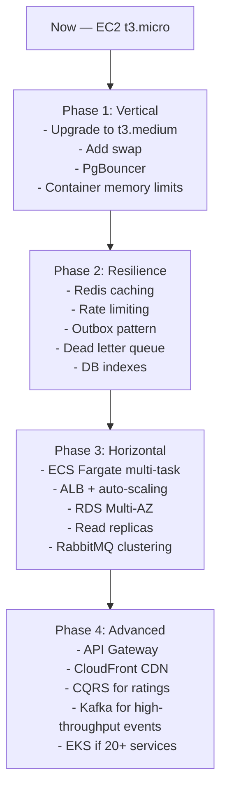

# Scaling Guide — MovieApp

_Current state: single EC2 t3.micro, all 6 containers on one machine, single PostgreSQL instance, no caching, no API gateway._

---

## Current Architecture Limitations

| Component | Current | Bottleneck |
|---|---|---|
| Compute | Single EC2 t3.micro (1GB RAM) | OOM with 6 containers, no horizontal scale |
| Database | PostgreSQL container on EC2 | Single point of failure, no read replicas, no pooling |
| Message broker | RabbitMQ container | Single node, no clustering |
| Frontend | Static build with IP baked in | Must rebuild on IP change, no CDN |
| Auth | JWT, no rate limiting | Brute force exposure, no token revocation cache |
| Service discovery | Hardcoded env vars | Manual updates on infrastructure change |
| Observability | OTLP traces, no sampling | Expensive at scale, no metrics/alerting |

---

## Layer 1 — Vertical Scaling (Immediate, Zero Architecture Change)

### 1.1 Upgrade EC2 Instance Type
```
t3.micro  (1GB)   → current, OOM risk
t3.small  (2GB)   → stable for demo
t3.medium (4GB)   → comfortable for all 6 containers
t3.large  (8GB)   → headroom for load testing
```
No code change. Stop instance → change type → start.

### 1.2 Add Swap Space
Bufs against OOM kills without instance upgrade.
```bash
sudo fallocate -l 2G /swapfile
sudo chmod 600 /swapfile && sudo mkswap /swapfile && sudo swapon /swapfile
echo '/swapfile none swap sw 0 0' | sudo tee -a /etc/fstab
```

### 1.3 PostgreSQL Connection Pooling — PgBouncer
**Problem:** Each .NET service opens its own connection pool. 3 services × 20 pool size = 60 connections. Postgres handles ~100-500 well; beyond that performance degrades.

**Fix:** Add PgBouncer to `docker-compose.yml`:
```yaml
pgbouncer:
  image: edoburu/pgbouncer
  environment:
    - DATABASE_URL=postgres://postgres:postgres@my_postgres:5432/
    - POOL_MODE=transaction
    - MAX_CLIENT_CONN=500
    - DEFAULT_POOL_SIZE=20
  ports:
    - "5433:5432"
```
Services connect to `pgbouncer:5432` instead of `my_postgres:5432`.

### 1.4 Configure Memory Limits on Containers
Prevent one container from starving the others:
```yaml
# docker-compose.services.yml
services:
  identity-service:
    mem_limit: 256m
    mem_reservation: 128m
  movie-service:
    mem_limit: 256m
  rating-service:
    mem_limit: 256m
  frontend:
    mem_limit: 128m
```
I deployed multiple containers on a t3.micro instance, which has only 1 GB RAM. The combined memory usage of the OS, Docker, Postgres, and .NET services exceeded available memory, triggering the Linux OOM killer. This caused containers to be terminated and eventually made the instance unresponsive, including SSH.
To debug, I would check container status using docker ps, inspect OOMKilled flags, analyze logs, and review system logs using dmesg to confirm OOM events. As remediation, I would add swap space, enforce container memory limits, optimize database memory usage, and ideally upgrade the instance size or introduce better resource isolation.

---

## Layer 2 — Horizontal Scaling (Multiple Instances)

### 2.1 Move to ECS Fargate (Already Tested)
ECS Fargate allows running multiple task instances per service. Set desired count and auto-scaling policy:
```
identity-service: min=1, max=5, scale on CPU > 70%
movie-service:    min=2, max=10, scale on CPU > 60%
rating-service:   min=2, max=10, scale on RequestCount > 1000/min
```
Fargate handles placement — no EC2 management.

### 2.2 Application Load Balancer (Already in ECS Setup)
ALB distributes traffic across multiple task instances. Health checks on `/health` automatically remove unhealthy instances.

**Sticky sessions:** Not needed — all 3 services are stateless (JWT carries user identity, DB carries state).

### 2.3 RabbitMQ Clustering
Current single-node RabbitMQ is a SPOF. For HA:
```yaml
# 3-node RabbitMQ cluster
rabbitmq1:
  image: rabbitmq:3-management
  environment:
    - RABBITMQ_ERLANG_COOKIE=secret
rabbitmq2:
  image: rabbitmq:3-management  
  environment:
    - RABBITMQ_ERLANG_COOKIE=secret
```
Or use **Amazon MQ** (managed RabbitMQ) — eliminates ops overhead.

### 2.4 Stateless Services Checklist
For horizontal scaling to work, services must be stateless:
- ✅ Identity Service — JWT is stateless, refresh tokens in DB
- ✅ Movie Service — all state in DB
- ✅ Rating Service — all state in DB, user identity from JWT claim
- ✅ Frontend — static Next.js, no server-side session

No sticky session requirement — scale freely.

---

## Layer 3 — Caching

### 3.1 Redis Cache Layer
Add Redis to docker-compose:
```yaml
redis:
  image: redis:7-alpine
  ports:
    - "6379:6379"
  networks:
    - movieapp-network
```

### 3.2 What to Cache

| Data | Cache Key | TTL | Invalidation |
|---|---|---|---|
| Movie details | `movie:{id}` | 5 min | On `MovieUpdated` event |
| Movie list (paginated) | `movies:page:{n}:size:{s}` | 2 min | On any movie write |
| Average ratings | `movie:rating:{id}` | 1 min | On `RatingUpdatedEvent` consumed |
| User profile | `user:{id}` | 10 min | On profile update |

### 3.3 Cache Implementation in .NET
```csharp
// IDistributedCache (Redis backed)
public async Task<MovieDto?> GetMovie(Guid id)
{
    var cached = await _cache.GetStringAsync($"movie:{id}");
    if (cached != null) return JsonSerializer.Deserialize<MovieDto>(cached);
    
    var movie = await _movieRepo.GetById(id);
    await _cache.SetStringAsync($"movie:{id}", 
        JsonSerializer.Serialize(movie), 
        new DistributedCacheEntryOptions { AbsoluteExpirationRelativeToNow = TimeSpan.FromMinutes(5) });
    return movie;
}
```

### 3.4 Rate Limiting with Redis
Sliding window per user/IP — prevents brute force on auth endpoints:
```csharp
// Middleware: check Redis counter before processing
var key = $"ratelimit:{ip}:{endpoint}:{window}";
var count = await _redis.StringIncrementAsync(key);
if (count == 1) await _redis.KeyExpireAsync(key, TimeSpan.FromMinutes(1));
if (count > limit) return Results.StatusCode(429);
```

---

## Layer 4 — Database Scaling

### 4.1 Managed Database — Amazon RDS
Move from PostgreSQL container to RDS:
- **Automated backups** — point-in-time recovery
- **Multi-AZ** — standby replica in different AZ, automatic failover in ~60s
- **Read replicas** — scale read traffic
- No manual patching or WAL management

### 4.2 Read Replicas
For `GET /movies` and `GET /ratings` (read-heavy endpoints):
```csharp
// Register two DbContexts
services.AddDbContext<WriteDbContext>(opt => opt.UseNpgsql(writeConnectionString));
services.AddDbContext<ReadDbContext>(opt => opt.UseNpgsql(readReplicaConnectionString));

// Repositories use read context for queries, write context for mutations
```

### 4.3 Database Indexes (Immediate Win)
Verify these exist — critical at scale:
```sql
-- Ratings table
CREATE INDEX CONCURRENTLY idx_ratings_movie_id ON "Ratings"("MovieId");
CREATE INDEX CONCURRENTLY idx_ratings_user_id  ON "Ratings"("UserId");

-- Movies table  
CREATE INDEX CONCURRENTLY idx_movies_title ON "Movies" USING gin(to_tsvector('english', "Title"));

-- RefreshTokens (Identity)
CREATE INDEX CONCURRENTLY idx_refresh_tokens_user_id ON "RefreshTokens"("UserId");
CREATE INDEX CONCURRENTLY idx_refresh_tokens_token   ON "RefreshTokens"("Token");
```

### 4.4 CQRS for Ratings
Ratings are write-heavy (every user action publishes an event). Split read and write models:
```
Write: Rating table (append-only insert/update)
Read:  MaterializedRatingView (pre-aggregated per movie, updated by consumer)
```
This is partially already done — `AverageRating` stored on Movie is the read model.

### 4.5 Partitioning for Ratings at Scale
With 1B+ ratings, partition the table by `MovieId` hash or by `CreatedAt` range:
```sql
CREATE TABLE ratings_2025 PARTITION OF ratings
    FOR VALUES FROM ('2025-01-01') TO ('2026-01-01');
```

---

## Layer 5 — Event Processing Scaling

### 5.1 Consumer Concurrency (MassTransit)
Currently using default single-thread consumer. Increase throughput:
```csharp
x.UsingRabbitMq((ctx, cfg) => {
    cfg.ReceiveEndpoint("rating-updated", e => {
        e.PrefetchCount = 50;           // fetch 50 messages ahead
        e.ConcurrentMessageLimit = 10;  // process 10 in parallel
        e.ConfigureConsumer<RatingUpdatedConsumer>(ctx);
    });
});
```

### 5.2 Competing Consumers Pattern
Run multiple instances of MovieService — each pulls from the same queue. RabbitMQ distributes messages round-robin. Linear throughput scaling.
```
RabbitMQ [rating-updated queue]
    ↓         ↓         ↓
MovieSvc1  MovieSvc2  MovieSvc3
```
Requires idempotent consumer (deduplicate by eventId).

### 5.3 Outbox Pattern (At-Least-Once Guarantee)
Prevents silent event loss when publish fails after DB write:
```csharp
// Same transaction: save rating + write to outbox
using var tx = await _db.BeginTransactionAsync();
await _ratingRepo.Save(rating);
await _outboxRepo.Save(new OutboxMessage { 
    Event = JsonSerializer.Serialize(ratingUpdatedEvent), 
    CreatedAt = DateTime.UtcNow 
});
await tx.CommitAsync();

// Background worker: poll outbox → publish → mark sent
```

### 5.4 Dead Letter Queue
Messages that fail after N retries go to a DLQ:
```csharp
e.UseMessageRetry(r => r.Intervals(1000, 5000, 15000)); // 3 retries
e.BindDeadLetterQueue("rating-updated-dlq");              // failed → DLQ
```
Monitor DLQ depth as a health metric. Replay after fixing the bug.

---

## Layer 6 — Frontend & CDN

### 6.1 CDN for Static Assets
Next.js builds static HTML/JS/CSS. Serve from CloudFront:
```
User → CloudFront (edge) → S3 (static files)
                        → EC2/ECS (API calls only)
```
Reduces latency globally, offloads traffic from EC2.

### 6.2 Server-Side Rendering → Static Generation
Movie listing pages can use `getStaticProps` with ISR (Incremental Static Regeneration):
```typescript
export async function getStaticProps() {
  // Pre-rendered at build time, revalidated every 60s
  const movies = await fetchMovies();
  return { props: { movies }, revalidate: 60 };
}
```
Eliminates API call latency for the most common page.

### 6.3 Decouple Frontend API URLs from Build
Currently `NEXT_PUBLIC_*` URLs are baked at build time. Use a **runtime config endpoint**:
```typescript
// Next.js fetches /api/config on startup
const config = await fetch('/api/config').then(r => r.json());
const IDENTITY_URL = config.identityUrl;
```
Allows changing backend URLs without rebuilding the image.

---

## Layer 7 — API Gateway & Rate Limiting

### 7.1 Add API Gateway
```
Before: Browser → EC2:5001, EC2:5002, EC2:5003 (3 connections)
After:  Browser → API GW :443 → route to services (1 connection)
```
Options: AWS API Gateway, Kong, NGINX, YARP (.NET native).

### 7.2 Rate Limiting Rules
| Endpoint | Limit | Window | Key |
|---|---|---|---|
| `POST /auth/login` | 5 req | 1 min | IP |
| `POST /auth/register` | 3 req | 1 min | IP |
| `GET /movies` | 100 req | 1 min | userId |
| `POST /rating` | 20 req | 1 min | userId |
| Global per user | 500 req | 1 min | JWT sub |

### 7.3 JWT Validation at Gateway
Move JWT validation out of each service into the gateway:
- Services receive `X-User-Id` and `X-User-Role` headers
- No crypto overhead in each service
- Centralised revocation check (Redis blocklist for compromised tokens)

---

## Layer 8 — Kubernetes / EKS (Long Term)

### When to consider EKS over ECS:
- 20+ microservices
- Need advanced traffic management (Istio service mesh)
- Multi-cloud or on-prem hybrid
- Fine-grained resource control per pod

### Key K8s scaling features for this project:
```yaml
# Horizontal Pod Autoscaler
apiVersion: autoscaling/v2
kind: HorizontalPodAutoscaler
metadata:
  name: rating-service-hpa
spec:
  minReplicas: 2
  maxReplicas: 20
  metrics:
    - type: Resource
      resource:
        name: cpu
        target:
          type: Utilization
          averageUtilization: 60
```

**Vertical Pod Autoscaler** — automatically right-sizes CPU/memory requests based on actual usage.

---

## Scaling Roadmap Summary



## Priority Matrix

| Improvement | Impact | Effort | Do When |
|---|---|---|---|
| DB indexes | High | Low | Now |
| Container memory limits | High | Low | Now |
| Swap space | Medium | Low | Now |
| PgBouncer | High | Low | > 3 service instances |
| Redis cache | High | Medium | > 100 req/s on movie reads |
| Rate limiting | High | Medium | Before public launch |
| Outbox pattern | High | High | Before production data matters |
| RDS Multi-AZ | High | Low (managed) | Before production |
| ECS auto-scaling | High | Medium | > 1000 req/min |
| API Gateway | Medium | Medium | When > 3 services or need SSL |
| CDN/CloudFront | Medium | Low | When frontend goes global |
| Read replicas | Medium | Medium | > 10k read req/min |
| RabbitMQ cluster | Medium | High | > 50k events/min |
| Kafka | High | Very High | > 1M events/min |
